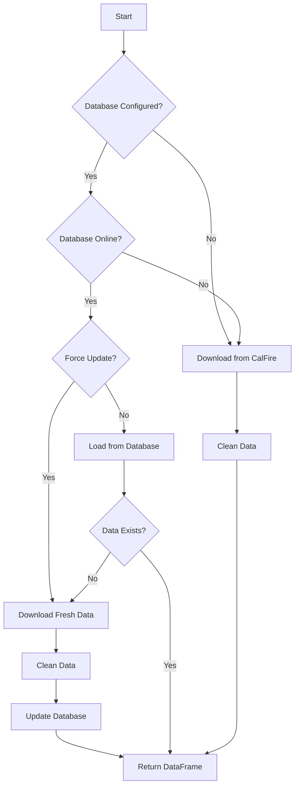

# 🔥 CalFire Incident Data Analysis

A comprehensive data analysis pipeline for California wildfire incidents using CalFire's public dataset. This project provides automated data collection, cleaning, storage, and exploratory data analysis (EDA) with intelligent database fallback mechanisms.

## Table of Contents
- [Overview](#overview)
- [Features](#features)
- [Installation](#installation)
- [Quick Start](#quick-start)
- [Usage](#usage)
- [Data Pipeline](#data-pipeline)
- [Database Configuration](#database-configuration)
- [Analysis Features](#analysis-features)
- [Project Structure](#project-structure)
- [Contributing](#contributing)
- [License](#license)

## Overview

This project analyzes California wildfire incident data from CalFire's public database, providing insights into fire patterns, duration, geographic distribution, and containment metrics. It features an intelligent data management system that seamlessly works with or without a Google Cloud PostgreSQL database.

### Key Capabilities
- **Automated Data Collection**: Downloads latest incident data from CalFire's public CSV endpoint
- **Smart Data Storage**: Optional Google Cloud PostgreSQL integration with automatic fallback
- **Data Cleaning**: Handles outliers, missing values, and geographic coordinate validation
- **Exploratory Data Analysis**: Comprehensive statistical analysis and visualizations
- **Resilient Architecture**: Works seamlessly whether database is online, offline, or unavailable

## Features

### Data Management
- **Automatic Data Updates**: Fetch latest CalFire incident data on-demand
- **Dual Storage Options**: PostgreSQL database or local DataFrame
- **Intelligent Fallback**: Automatically switches to direct download if database is unavailable
- **Data Cleaning Pipeline**: Automated handling of missing values and outliers

### Analysis Capabilities
- **Statistical Analysis**: Comprehensive EDA with descriptive statistics
- **Geographic Validation**: California boundary checking for coordinates
- **Outlier Detection**: IQR-based outlier handling for numerical variables
- **Visualizations**: Before/after comparisons, distributions, and trends

## Installation

### Prerequisites
- Python 3.8+
- Jupyter Notebook or JupyterLab
- (Optional) Google Cloud account with PostgreSQL instance

### Required Libraries

```bash
pip install pandas numpy matplotlib sqlalchemy pg8000 google-cloud-sql-connector
```

### Clone Repository

```bash
git clone https://github.com/yourusername/calfire-analysis.git
cd calfire-analysis
```

## Quick Start

### Option 1: Without Database (Simplest)

```python
```

### Option 2: With Database

```python
```

## Usage

### Basic Data Loading

```python

```

### Data Cleaning Example

```python

```

### Outlier Handling Visualization

```python

```

## Data Pipeline



## 🗄️ Database Configuration

### Google Cloud PostgreSQL Setup

1. **Create Instance**: Set up a PostgreSQL instance in Google Cloud Console
2. **Get Connection String**: Format: `project:region:instance`
3. **Set Credentials**: Create user with appropriate permissions
4. **Configure Access**: Ensure your IP is whitelisted

### Connection Parameters

```python
# Example configuration
config = {
    'instance_connection_name': 'project-id:us-west1:instance-name',
    'db_user': 'postgres',
    'db_pass': 'your-secure-password',
    'db_name': 'calfire_db'  # Created automatically
}
```

## Analysis Features

### Available Data Fields

- `incident_name`: Fire incident name
- `incident_date_created`: Start date of incident
- `incident_date_extinguished`: Containment date
- `incident_county`: County location
- `incident_acres_burned`: Total acres affected
- `incident_containment`: Containment percentage
- `incident_latitude/longitude`: Geographic coordinates
- `duration_days`: Calculated fire duration

### Key Analyses Included

1. **Temporal Analysis**: Fire frequency and duration trends
2. **Geographic Distribution**: County-level incident mapping
3. **Severity Metrics**: Acres burned and containment analysis
4. **Outlier Detection**: Statistical anomaly identification
5. **Data Quality**: Missing value and coordinate validation

## Project Structure

```
calfire-analysis/
├── calfire_data_handler.py      # Main data management module
├── CALFIRE_Analytics_Notebook.ipynb  # Analysis notebook
├── README.md                     # This file
├── requirements.txt              # Python dependencies
├── data/                        # Local data storage (gitignored)
│   └── cached_data.csv
└── outputs/                     # Analysis outputs
    ├── figures/
    └── reports/
```

## Contributing

Contributions are welcome! Please feel free to submit a Pull Request. For major changes, please open an issue first to discuss what you would like to change.

### Development Setup

1. Fork the repository
2. Create your feature branch (`git checkout -b feature/AmazingFeature`)
3. Commit your changes (`git commit -m 'Add some AmazingFeature'`)
4. Push to the branch (`git push origin feature/AmazingFeature`)
5. Open a Pull Request

### Code Style

- Follow PEP 8 guidelines
- Add docstrings to all functions
- Include type hints where appropriate
- Write unit tests for new features

## 📄 License

This project is licensed under the MIT License - see the [LICENSE](LICENSE) file for details.

## Acknowledgments

- CalFire for providing public incident data
- Google Cloud Platform for database infrastructure
- The Python data science community for excellent tools

## Contact

For questions or support, please open an issue on GitHub or contact [your-email@example.com]

---

**Note**: This project is for educational and research purposes. Always refer to official CalFire sources for critical decision-making.
